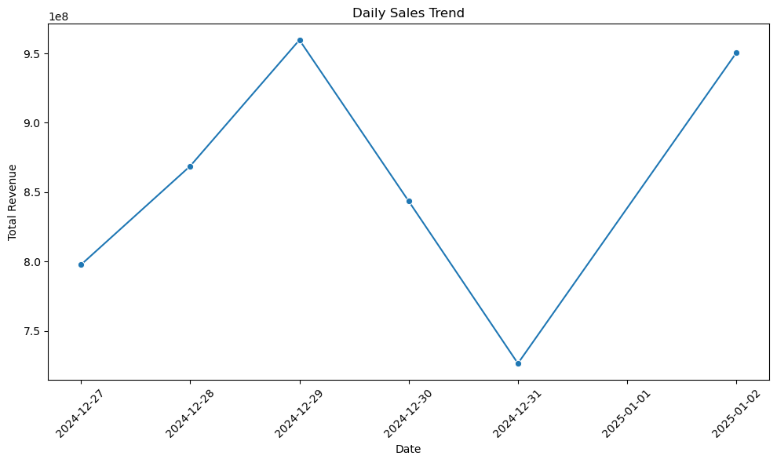

# Retrieval Augmented Generation (RAG)


<!-- WARNING: THIS FILE WAS AUTOGENERATED! DO NOT EDIT! -->

RAG (Retrieval Augmented Generation) is a powerful AI architecture that
combines information retrieval with text generation to produce more
accurate and contextually relevant responses. It represents a
significant advancement in how AI systems access and utilize knowledge.

## What is RAG

RAG works by:

1.  **Retrieving** relevant information from a knowledge base
2.  **Augmenting** the input prompt with this retrieved context
3.  **Generating** responses using both the original prompt and
    retrieved information

## Why RAG Important

RAG addresses a fundamental limitation of Large Language Models (LLMs):
they can’t directly answer questions about specific or up-to-date
information that wasn’t part of their training data. Some use cases
require:

- Access to private or proprietary information
- Real-time or frequently updated data
- Domain-specific knowledge
- Company-specific policies and procedures

By incorporating a retrieval system, RAG enables LLMs to access and
leverage this additional context when generating responses, making them
more accurate and useful for specialized applications.

## How RAG Works

The example of use case of RAG is to query a database using natural
language. We can give a prompt to the LLM to query the database and the
LLM will generate the SQL query to get the data.

### RAG System Flowchart

> This is the flowchart of RAG system for natural language database
> querying:


### RAG works in detail

**1. Input Processing:** - User submits a natural language query - Query
is analyzed for intent and key entities - Query is converted to vector
embeddings for semantic matching

**2. Retrieval Phase:** - Documents/Database schema are pre-processed
into chunks - Chunks are converted to embeddings and stored in vector
database - System performs semantic search to find relevant context -
Retrieves most similar documents/schema information

**3. Augmentation Phase:** - Retrieved context is processed and
filtered - Original query is reformulated with context - SQL query is
generated using the enhanced understanding

**4. Database Interaction:** - Generated SQL queries the target
database - Results are fetched from the database

**5. Generation Phase:** - Combines original query, context, and
database results - Generates natural language response - Returns
formatted answer to user

## RAG In Action

### System Flowchart


The flowchart above illustrates the end-to-end process of our RAG
(Retrieval-Augmented Generation) system:

1.  The process begins with a user’s natural language query, which is
    converted into an embedding
2.  In parallel, the BigQuery schema is also embedded
3.  The Model Processing phase includes:
    - An LLM that processes both embeddings
    - Generation of SQL queries
    - Data analysis logic
    - Visualization code generation
4.  The generated SQL query is executed against BigQuery database to
    fetch results
5.  The query results flow into:
    - Data analysis processing
    - Matplotlib visualization generation
6.  Finally, both the analysis results and visualizations are combined
    into a comprehensive response for the user This architecture enables
    natural language interactions with data while providing both
    analytical insights and visual representations.

### Code Example

<details open class="code-fold">
<summary>Code</summary>

``` python
import matplotlib.pyplot as plt
import seaborn as sns
from typing import Union, Tuple
import warnings
import logging

# Filter out specific warnings and logs
warnings.filterwarnings('ignore', category=FutureWarning)
logging.getLogger('google.cloud.bigquery').setLevel(logging.ERROR)
logging.getLogger('google.api_core').setLevel(logging.ERROR)

# Add BigQuery table variables
# project_id = ""
# dataset_id = ""
# table_id = ""

class RAGQueryEngine:
    def __init__(self):
        """Initialize with table schema"""
        schema_query = f"""
        SELECT 
            column_name, data_type
        FROM `{project_id}.{dataset_id}.INFORMATION_SCHEMA.COLUMNS` 
        WHERE table_name = '{table_id}'
        """
        schema_df = bq_client.query(schema_query).to_dataframe()
        self.schema = schema_df.to_dict('records')
        
    def get_sql_query(self, user_question: str) -> str:
        """Generate SQL query from natural language question"""
        schema_str = "\n".join([f"- {col['column_name']}: {col['data_type']}" for col in self.schema])
        
        prompt = f"""
        Convert this question to a SQL query for BigQuery:
        {user_question}
        
        Use the table: `{project_id}.{dataset_id}.{table_id}`
        
        Table schema:
        {schema_str}
        
        The query should:
        - Be valid SQL that starts with SELECT
        - Return relevant data for visualization using the correct columns from the schema
        - Include date/time fields if asking about trends
        - Use proper table names and column references
        - Not include any explanatory text, only the SQL query
        """
        
        response = client.chat.completions.create(
            model="gpt-4",
            messages=[
                {"role": "system", "content": "You are an expert SQL writer. Write only valid BigQuery SQL queries without any explanatory text. Always use fully qualified table names."},
                {"role": "user", "content": prompt}
            ],
            temperature=0.3
        )
        
        sql = response.choices[0].message.content.strip()
        # Ensure query starts with SELECT
        if not sql.upper().startswith('SELECT'):
            raise ValueError("Invalid SQL query generated")
        return sql

    def generate_visualization(self, df, question: str) -> Tuple[str, plt.Figure]:
        """Generate visualization and explanation based on data"""
        # Create figure
        plt.close('all')  # Close all existing figures
        fig = plt.figure(figsize=(10, 6))
        ax = fig.add_subplot(111)
        
        # For time series data with dates and numeric values, default to line plot
        if 'transaction_date' in df.columns and 'total_revenue' in df.columns:
            sns.lineplot(data=df, x='transaction_date', y='total_revenue', ax=ax, marker='o')
            plt.title('Daily Sales Trend')
            plt.xlabel('Date')
            plt.ylabel('Total Revenue')
            plt.xticks(rotation=45)
            plt.tight_layout()
            return self.generate_explanation(df, question), fig
            
        # If not a time series, use the AI recommendation approach
        prompt = f"""
        Question: {question}
        
        Data columns: {', '.join(df.columns)}
        Sample data: {df.head().to_string()}
        
        What type of plot would best visualize this data? Choose from:
        1. Line plot (for trends over time)
        2. Bar plot (for comparisons)
        3. Scatter plot (for relationships)
        4. Pie chart (for composition)
        
        Provide your recommendation in format:
        PLOT_TYPE: <type>
        X_AXIS: <column>
        Y_AXIS: <column>
        TITLE: <title>
        """
        
        response = client.chat.completions.create(
            model="gpt-4",
            messages=[
                {"role": "system", "content": "You are a data visualization expert. Recommend the best chart type."},
                {"role": "user", "content": prompt}
            ],
            temperature=0.3
        )
        
        viz_specs = response.choices[0].message.content.strip().split('\n')
        plot_type = viz_specs[0].split(': ')[1].lower()
        x_col = viz_specs[1].split(': ')[1]
        y_col = viz_specs[2].split(': ')[1]
        title = viz_specs[3].split(': ')[1]

        # Create visualization based on type
        try:
            if plot_type == 'line':
                df = df.sort_values(by=x_col)
                sns.lineplot(data=df, x=x_col, y=y_col, ax=ax, marker='o')
            elif plot_type == 'bar':
                sns.barplot(data=df, x=x_col, y=y_col, ax=ax)
            elif plot_type == 'scatter':
                sns.scatterplot(data=df, x=x_col, y=y_col, ax=ax)
            elif plot_type == 'pie':
                plt.pie(df[y_col], labels=df[x_col], autopct='%1.1f%%')
            
            plt.title(title)
            if plot_type != 'pie':
                plt.xticks(rotation=45)
            plt.tight_layout()
            
        except Exception as e:
            print("\n❌ Error generating visualization:")
            print(f"   {str(e)}")
            
        return self.generate_explanation(df, question), fig

    def generate_explanation(self, df, question: str) -> str:
        """Generate explanation of the visualization"""
        explanation_prompt = f"""
        Question: {question}
        
        Data Results:
        {df.to_string()}
        
        Please provide a clear, concise explanation of the visualization and key insights.
        """
        
        explanation = client.chat.completions.create(
            model="gpt-4",
            messages=[
                {"role": "system", "content": "You are a helpful data analyst. Explain visualizations clearly."},
                {"role": "user", "content": explanation_prompt}
            ],
            temperature=0.7
        )
        
        return explanation.choices[0].message.content.strip()

    def query(self, question: str) -> Tuple[str, plt.Figure]:
        """Main method to process natural language query"""
        try:
            # Generate SQL
            sql_query = self.get_sql_query(question)
            print("\n📝 Generated SQL Query:")
            print(f"   {sql_query}")
            
            # Execute query
            query_job = bq_client.query(sql_query)
            results = query_job.result().to_dataframe()
            print("\n📊 Query Results Preview:")
            print(f"{results.head().to_string()}\n")
            
            # Generate visualization and explanation
            explanation, fig = self.generate_visualization(results, question)
            
            return explanation, fig
            
        except Exception as e:
            print("\n❌ Error occurred:")
            print(f"   {str(e)}")
            return f"Error processing query: {str(e)}", None

def main(question: str):
    rag_engine = RAGQueryEngine()
    print("\n" + "="*50)
    print(f"🔍 Question: {question}")
    print("="*50 + "\n")
    
    explanation, fig = rag_engine.query(question)
    
    print("\n" + "="*50)
    print("📈 Analysis:")
    print(f"{explanation}")
    print("="*50)
    
    if fig:
        plt.show()

if __name__ == "__main__":
    main("Show me the daily sales trend for the past week?")
```

</details>

    I0000 00:00:1735895683.666072 26569273 check_gcp_environment_no_op.cc:29] ALTS: Platforms other than Linux and Windows are not supported


    ==================================================
    🔍 Question: Show me the daily sales trend for the past week?
    ==================================================


    📝 Generated SQL Query:
       SELECT 
      DATE(transaction_datetime) AS transaction_date,
      SUM(revenue) AS total_revenue
    FROM 
      `sukses-group-398313.playground.captain_transaction_details`
    WHERE 
      DATE(transaction_datetime) BETWEEN DATE_SUB(CURRENT_DATE(), INTERVAL 7 DAY) AND CURRENT_DATE()
    GROUP BY 
      transaction_date
    ORDER BY 
      transaction_date ASC

    I0000 00:00:1735895691.762848 26569273 check_gcp_environment_no_op.cc:29] ALTS: Platforms other than Linux and Windows are not supported


    📊 Query Results Preview:
      transaction_date  total_revenue
    0       2024-12-27      797630000
    1       2024-12-28      868785000
    2       2024-12-29      959685000
    3       2024-12-30      843480000
    4       2024-12-31      726495000


    ==================================================
    📈 Analysis:
    Visualization Explanation:

    In this example, the visualization would be a line graph showing daily sales over the past week. On the x-axis, we have the transaction date, and on the y-axis, we have the total revenue for each day. Each point on the graph represents the total revenue for a specific day, and these points are connected by a line to show the trend over time.

    Key Insights:

    1. The sales revenue is not constant and varies from day to day. 
    2. There is a significant increase in total revenue from 27th to 29th of December, peaking at 959,685,000.
    3. The revenue then drops on 30th and 31st of December, with the lowest point of the week at 726,495,000 on the 31st.
    4. However, the revenue bounces back up on 2nd January, reaching 950,505,000, nearly returning to the peak level of the week.

    By observing this trend, we can identify patterns in sales and use this data to predict future sales trends. The dips and peaks might be associated with specific events or promotions, suggesting areas for further investigation. For instance, we might want to find out why sales dipped towards the end of December and what caused them to recover in early January.
    ==================================================



## Closing

This example demonstrates the power of RAG (Retrieval Augmented
Generation) in creating intelligent data analysis systems. By combining
natural language processing, SQL generation, and automated
visualization, RAG enables non-technical users to gain valuable insights
from complex datasets through simple conversational queries.
