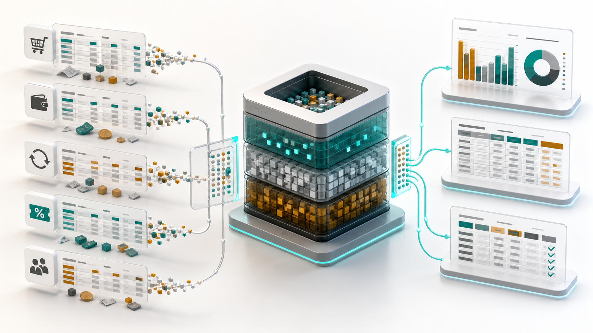

## Background

When I started thinking seriously about the data pipeline for Omnichannel, my first instinct was to use **ELT**.

For context, Omnichannel is a finance-focused marketplace reconciliation system. The goal is to help marketplace businesses understand their real income, real payout, every fee deducted from each order, and eventually their actual profit.

That means the system needs to collect data from many marketplace sources. Order data, settlement data, payout data, product data, refund data, voucher data, commission data, adjustment data, and probably more as the product grows.

At first, ELT felt like the obvious choice.

Instead of transforming everything before saving it, I can extract the data, load the raw data as it is, and transform it later inside the warehouse or analytical layer.

The more I thought about it, the more I liked it.

## Why ELT Feels Amazing

In the old way, I usually think about data pipeline as ETL.

Extract the data, transform it into the format that I need, then load the clean result into the database.

That sounds reasonable. But the problem is, when the product is still early, I do not always know the perfect format yet.

Especially for marketplace data.

Each marketplace has their own format, their own term, and their own strange edge case. Shopee, TikTok Shop, Tokopedia, and other marketplaces can describe similar business events with different columns and different names.

If I transform everything too early, I need to make too many assumptions too soon.

With ELT, the mindset is different.

I can save the raw data first.

Then I can build transformation logic on top of that raw data after I understand the business question better.

That gives me several benefits:

1. **The raw source of truth is preserved**

   If I make a mistake in the transformation logic, I can fix the model and rerun it from the raw data. I do not need to ask the user to upload or sync the same data again.

2. **The product can evolve faster**

   In the beginning, I may only need sales summary. Later, I may need settlement matching, fee breakdown, profit calculation, or finance reconciliation. If the raw data is already stored, I can add new models without changing the extraction process too much.

3. **Debugging becomes easier**

   When the number looks wrong, I can compare the final transformed table with the original marketplace report. This is very important for a finance product, because the user needs to trust the number.

4. **Storage is much cheaper than before**

   Years ago, maybe storing every raw record felt expensive. But now storage is cheap compared to the cost of losing context or rebuilding the same pipeline many times.

5. **The warehouse is built for transformation**

   Analytical databases are already strong at joining, aggregating, filtering, and transforming large data. So instead of forcing the application backend to do too much, I can let the data layer do the work it is good at.

Because of that, my first decision was simple.

For Omnichannel, I will use ELT.

Extract the marketplace data, load the raw data, then transform it into reporting and reconciliation models.

Done.

At least, that was what I thought.

## The ETL Idea That Looked Too Good

Then I worked on another project: a Meta Ads dashboard.

In that project, I had a different problem.

The user wanted the dashboard to feel fresh. Not necessarily real-time in the technical meaning, but fresh enough that when they opened the dashboard, they felt like the data was up to date.

After brainstorming with my team, we found a very simple idea.

When the user opens the app, the app checks data freshness first.

If the data was refreshed less than 15 minutes ago, the app just fetches the existing data.

If the data is older than 15 minutes, the app refreshes the data first, then shows the result.

The flow is something like this:

1. User opens the dashboard.
2. The app checks when the data was last refreshed.
3. If the data is still fresh, the app fetches the cached data.
4. If the data is stale, the app refreshes from the Meta Ads API first.
5. The app transforms and saves the clean data.
6. The dashboard shows the latest available result.

It is not truly real-time.

But from the user experience, it feels almost real-time.

And the best part is the implementation is far simpler than building a full streaming or event-driven data pipeline.

For Meta Ads, this works because the data shape is small and predictable.

The main dimensions are usually date, campaign, ad set, and ad. The amount of data is not too large. The transformation logic is manageable. If the app needs to refresh the data before showing the dashboard, the user can still wait for a reasonable time.

At that moment, ETL looked attractive again.

I started thinking:

> Maybe I can use the same approach for Omnichannel.

Instead of loading raw data first and transforming later, maybe I can refresh the source data, transform it immediately, save the clean result, and show the dashboard.

It sounds simpler.

It also sounds more interactive.

So I tried to bring that idea into Omnichannel.

## The Marketplace Data Reality

Apparently, the same pattern did not work as well.

The problem is not that ETL is bad.

The problem is that marketplace data is a different type of problem.

In Meta Ads, the data is relatively small. The dimensions are clear. The dashboard mostly needs performance metrics by date, campaign, ad set, and ad.

In marketplace data, the shape is much more complicated.

For each day, one marketplace can already generate thousands of rows across multiple tables. And those tables are not only for analytics. They are also connected to finance operations.

There can be:

- order rows
- order item rows
- settlement rows
- payout rows
- refund rows
- product rows
- SKU mapping rows
- commission rows
- voucher rows
- shipping subsidy rows
- adjustment rows

And each of those tables can have their own lifecycle.

An order can happen today, but the settlement may come later. A payout may group many orders. A refund can change the final number. A commission or adjustment can appear in another report. The finance view is not just one table grouped by date.

It needs matching.

It needs history.

It needs reconciliation.

It needs trust.

That is where the on-demand ETL idea started to become a disaster.

If the user opens an analytics-heavy page, I cannot just refresh everything, transform everything, run all joins, calculate all metrics, and expect the app to still feel fast.

Some pages need window functions. Some views need cumulative logic. Some reports need matching between order and settlement data. Some calculations need to look across different dates because marketplace payout does not always happen on the same date as the order.

The more I tried to make it feel like the Meta Ads dashboard, the more I realized I was forcing a pattern from one problem into another problem.

Meta Ads data can be refreshed on demand because it is small and simple enough.

Marketplace finance data needs a more durable data foundation.

## Why ELT Makes More Sense Here

For Omnichannel, I need to optimize for correctness, traceability, and flexibility.

That is why ELT makes more sense.

The raw marketplace data should be stored first. After that, transformation models can turn it into cleaner layers:

- raw marketplace reports
- standardized marketplace tables
- order and settlement matching models
- finance-ready reporting tables
- dashboard and analytics marts

That way, each layer has a clear responsibility.

If a user questions a number, I can trace it back.

If a marketplace changes its report format, I can adjust the model.

If I discover a better way to calculate a fee, I can rerun the transformation.

If I need a new analytics page, I can build it on top of existing raw and standardized data.

This is important because Omnichannel is not only a dashboard. It is a trust product.

If the number is wrong, the product fails.

If the user cannot understand where the number comes from, the product fails.

If the system hides too much transformation inside one refresh process, debugging becomes painful.

With ELT, I have more room to build the data model carefully.

## The Lesson

The lesson for me is not "ELT is always better than ETL."

That would be too simple.

The real lesson is that there is no single correct solution for every data problem.

ETL can be amazing when the data is small, predictable, and the user experience benefits from freshness. The Meta Ads dashboard is a good example. The data can be refreshed quickly, transformed immediately, and shown to the user with an almost real-time feeling.

ELT is better when the data is large, messy, historical, and analytics-heavy. Especially when the product needs traceability and the business logic will keep evolving. Omnichannel is closer to this problem.

The mistake is not choosing ETL or ELT.

The mistake is choosing one because it worked in a different project.

As engineers, it is easy to fall in love with a pattern. Once something works well, we want to reuse it everywhere. But the correct solution depends on the shape of the data, the freshness requirement, the business logic, and what the user needs to trust.

For Omnichannel, I decided to go back to ELT.

Not because ETL is wrong.

But because this project needs raw data, traceable transformation, and a data foundation that can grow with the complexity of marketplace finance.

That is the kind of tradeoff I need to keep remembering.

The goal is not to use the most popular data architecture.

The goal is to choose the architecture that fits the problem.
