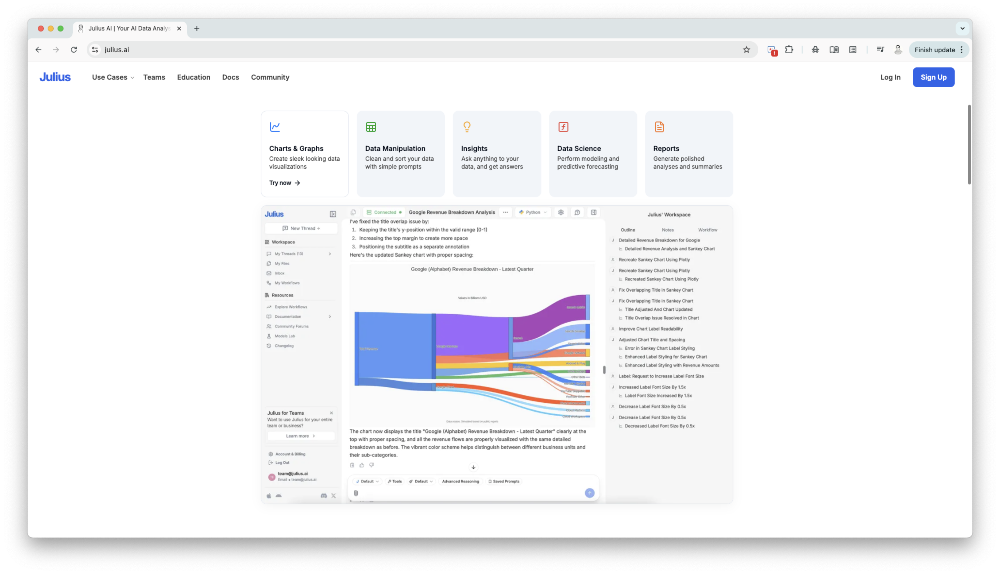
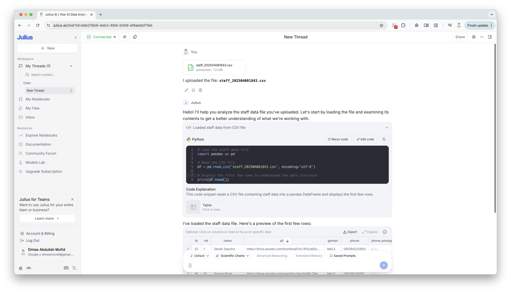
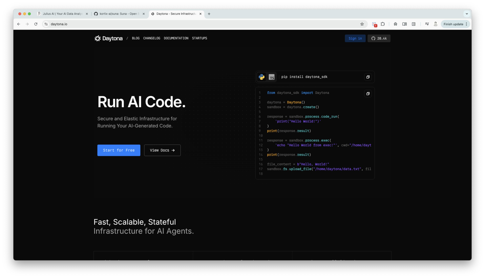
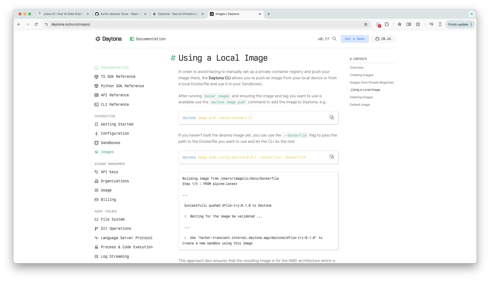

## Background

This is my first day building the FastAPI backend service for Mark, after setting up the initial directory yesterday. As a data engineer and data scientist, I already have experience with Python, but this is my first time building a backend application with FastAPI. That makes the work challenging, but also exciting, because I can use AI as a partner while I learn the backend side more deeply.

## The Process I have done

### Turning the backend plan into a product shape

Before writing too much code, I needed to make the backend roadmap clearer. Mark is not only a normal CRUD backend. The product that I want to build is closer to a conversational data analyst: the user asks a question, Mark understands the request, decides whether it needs code execution, runs the code safely, and then returns the result in a useful explanation.

That means the backend has several responsibilities that must work together. The first foundation is the regular application layer: user signup, signin, JWT authentication, chat sessions, message history, and PostgreSQL persistence through SQLModel and Alembic. This part is already mostly done. It is not the most exciting part of the product, but it is important because every conversation needs an owner, a session, and a history that can be reused as context.

The second part is the LLM interaction service. This will become the "brain" of Mark. It needs to read the user's question and the previous chat context, then decide whether the answer can be written directly or whether Mark needs to generate Python code. If code is needed, the model should generate the code, wait for execution results, and then turn those results back into a readable answer for the user. The important thing here is that code execution should feel like an internal tool, not something the user needs to manage manually.

The third part is data context. Since Mark is intended to help with data analysis, the LLM needs to know what data is available before it can generate useful queries. For BigQuery, that means preparing table metadata, column descriptions, and other context that can guide the model when writing SQL or Python. Without this layer, the LLM might write code that looks correct but points to the wrong table or uses columns that do not exist.

The final part is orchestration through the main chat API. This endpoint will receive the user's message, load the chat history, call the LLM service, execute Python when needed, pass the execution result back to the LLM, save the final response, and return a clean answer to the frontend. In other words, the chat endpoint becomes the conductor. It should hide the complexity behind one simple user experience.

For the MVP, I want Mark to support three core tool behaviors first: querying BigQuery, transforming data with Python, and generating Plotly visualizations. After that, I can improve the prompts, add better error handling, support uploaded files, and keep hardening the sandbox security.

### Julius AI

The first thing I need to try is the **code generator**. To assess whether it is feasible to do or not. I strongly believe it is feasible because there is already real software which could do that. For instance, I inspire a lot from [julius.ai](https://julius.ai/). It is an AI to help data analyst working on data analysis and data manipulation.

This is how they could generate python code, run it, and return the result also in the UI.

So it must be feasible. But I need to try it first, to define how challenging it is and how much cost is it, whether it is cost for development and also cost for running it.

### Sandbox

Therefore, I start to research on how to do it. At first, I need to have an LLM model to generate python code based on a user need. After that I need to feed those python code into the code generator.

After I doing my research, apparently the term for separated and isolated compute to which can run service as we need is called **Sandbox**. This is what are the alternatives on achieve it, which absolutely have their own pros and cons for each.

#### Common Sandboxing Techniques & Considerations:

1. **Custom Python Interpreters/Executors:**

- **How it works:** Re-implementing parts of the Python interpreter or using Abstract Syntax Tree (AST) manipulation to control execution. This allows disallowing certain imports, functions (like `open`, `eval`, `exec`), or even specific operations.

- **Pros:** Fine-grained control over what code can do. Can be implemented within the same process.

- **Cons:** Very complex to get right. "Sandboxing in Python is notoriously hard" (from Valentino Gagliardi's blog). A determined attacker might still find ways to bypass restrictions if not perfectly implemented. Might limit the capabilities of the generated code too much (e.g., if essential safe libraries are disallowed).

- **Examples:** HuggingFace `smolagents` has a `LocalPythonExecutor` that works by parsing the AST and allowing/disallowing operations. The Moveworks blog discusses a custom, slimmed-down Python interpreter.

#### 2. **Docker Containers:**

- **How it works:** Running the LLM-generated code inside an isolated Docker container. The container has its own filesystem, network stack (which can be restricted), and process space.

- **Pros:** Strong isolation at the OS level. Easier to manage dependencies (by defining them in a `Dockerfile`). Can set resource limits (CPU, memory). Well-established technology.

- **Cons:** Higher overhead (starting a container for each code execution can be slow). Requires Docker to be installed and running on the host. Managing communication between the main app and the container (passing code, data, and results) adds complexity.

- **Examples:** `llm-sandbox` library on GitHub, Azure Container Apps dynamic sessions. The Medium article by Shrish details building a FastAPI app inside Docker for sandboxing.

#### 3. **WebAssembly (WASM) / Pyodide:**

- **How it works:** Pyodide compiles Python and many popular libraries (like Pandas, NumPy) to WebAssembly. This allows Python code to run in a browser's WASM sandbox or a server-side WASM runtime.

- **Pros:** Strong sandboxing (leveraging browser sandbox technology). Can be fast if the WASM runtime is already initialized.

- **Cons:** Not all Python libraries are available or fully functional in Pyodide. Might have limitations on system-level access (e.g., direct network calls beyond `fetch`, filesystem access outside a virtual FS). Still an evolving ecosystem for server-side Python in WASM.

#### 4. **Microservices for Code Execution:**

- **How it works:** A separate service (potentially on a different machine or in a more restricted network zone) is responsible for executing the code. This is often combined with Docker or other isolation techniques for the microservice itself.

- **Pros:** Decouples code execution from the main application. Can be scaled independently. Enforces a clear boundary.

- **Cons:** Adds architectural complexity (inter-service communication, deployment, monitoring of another service).

#### 5. **RestrictedPython:**

- **How it works:** A tool that takes Python source code and verifies that it doesn't use unsafe operations, then compiles it to safe bytecode.

- **Pros:** Aims to provide a subset of Python that is safe to execute.

- **Cons:** It's not a complete sandbox on its own and is often used in conjunction with other measures. It restricts the language features available, which might be too limiting for complex code. Its security guarantees have been questioned in some contexts if not used perfectly.

#### **Key Security Principles Mentioned:**

- **Principle of Least Privilege:** The execution environment should only have the permissions absolutely necessary.

- **Resource Limits:** Impose strict limits on execution time, memory usage, CPU usage, network access, and file system access.

- **Input Validation/Sanitization (for prompts):** While the focus here is on executing the _output_ of the LLM, prompt injection is a risk that could lead to malicious code generation.

- **AST Analysis:** Parsing the code's Abstract Syntax Tree to allow/disallow specific operations or language features (as seen in `smolagents` and Moveworks' approach).

- **Dependency Control:** Carefully manage which libraries are available to the executed code. Only allow trusted and necessary libraries.

- **Ephemeral Environments:** Destroy the sandbox/container after each execution to prevent state leakage or persistent compromises.

- **Fuzz Testing:** Test the sandbox with randomly generated code to find vulnerabilities (Moveworks).

- **Monitoring and Logging:** Keep track of what code is being executed and its behavior.

Apparently it is challenging to do it, and very sensitive in terms of security. After thinking about the best approach, I remembered the [Suna](https://github.com/kortix-ai/suna) project that I previously studied. Suna also needs a sandbox so its agent can do real work without exposing the main application environment. They use a third-party service called [Daytona](https://www.daytona.io/), which describes itself as a _"Secure agent execution environment"_.

Moreover, for the isolated sandbox environment that we are going to build, we can customized the image.

## Closing

With all that consideration, in this Mark project, I decide to build the sandbox environment using Daytona. It is challenging at first, but it is working, and we don't need to think more about the security.
